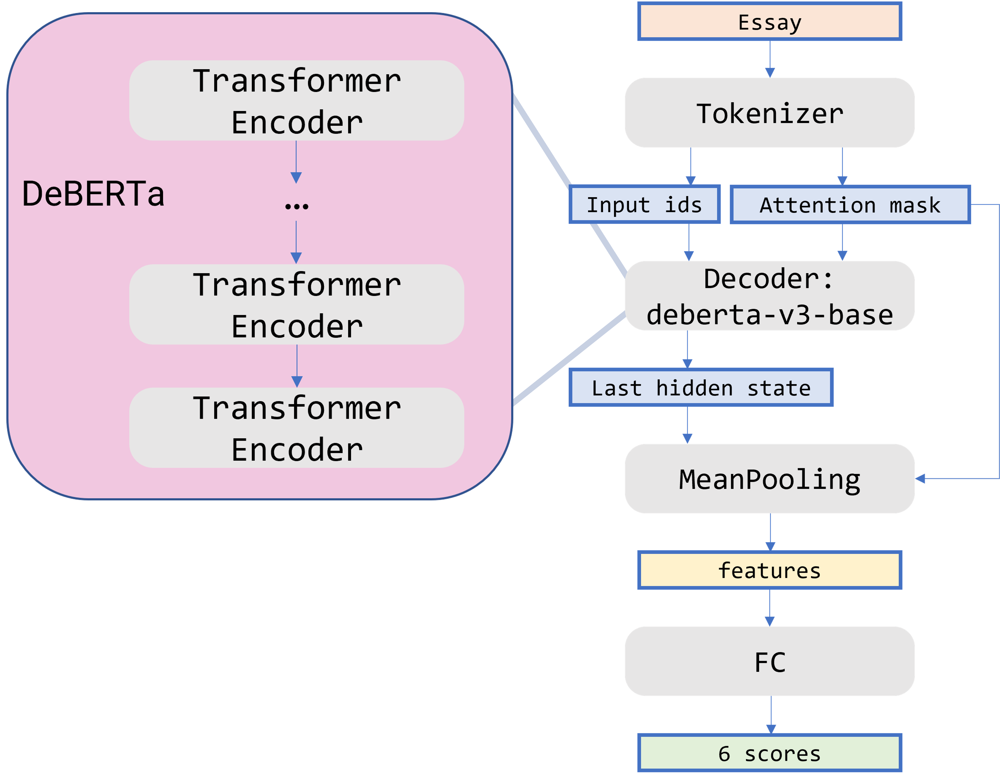
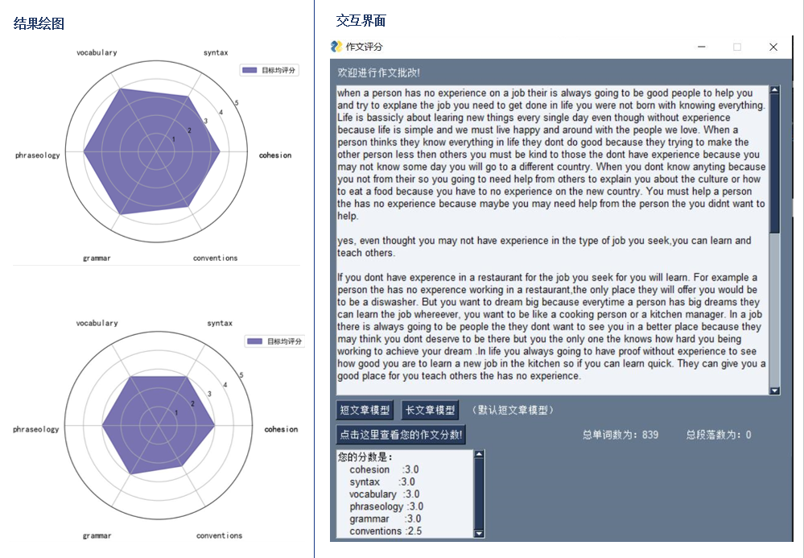

# Score an Essay v1.7

#### 介绍

我们小组使用基于Transformer的预训练大语言模型DeBERTa，使用给定的数据集，完成了英语作文评分任务。

研究动机：
使用人工智能代替人工进行英语作文评分已成为自然语言处理领域较为成功的一项任务，这一任务由图神经网络实现的代码及其使用的数据集已在 Kaggle 平台上开源，我们猜测使用Transformer架构的预训练模型可能可以取得比GNN更好的效果。

取得成果：
我们取得的mcrmse分数（越低越好）为0.4422。已接近kaggle平台该比赛的金牌项目得分（0.4334），并远远击败图神经网络项目得分（ 0.7139 ）。

研究意义：
我们常发现在写完英语作文后很难找到其他人能够帮忙对作文评分，本项目可以帮助学习英语写作的同学对一篇文章的写作水平有个快速，粗略的了解。

#### 数据集

kaggle比赛链接：
https://www.kaggle.com/competitions/feedback-prize-english-language-learning/

数据集介绍：
数据集（ELLIPSE语料库）包括由8至12年级的英语学习者（ELLs）撰写的辩论性文章。这些文章根据六个分析指标进行评分：连贯性、语法、词汇、短语表达、语法和规范。
每个指标代表作文水平的一个组成部分，分数越高表示在该指标上的作文水平越高。分数范围从1.0到5.0，每次增加0.5。你的任务是预测测试集中每篇文章的这六个指标的分数。

数据集文件和字段信息：
train.csv - 训练集，包括每篇文章的full_text，由唯一的text_id标识。
test.csv - 对于测试数据，只提供了文章的full_text以及它的text_id。
sample_submission.csv - 一个以正确格式保存的提交文件。

#### 模型介绍

输入文本分词后通过 DeBERTa骨干模型提取隐藏状态，这些隐藏状态被传递给均值池化模块，产生固定长度的文本表示，这个文本表示被送入全连接神经网络，输出预测结果。

#### 安装教程

1.  下载数据集

从 <a href="https://www.kaggle.com/competitions/feedback-prize-english-language-learning/data">https://www.kaggle.com/competitions/feedback-prize-english-language-learning/data</a> 下载数据集

放入 <strong>.\input\feedback-prize-english-language-learning</strong> 路径下

2.  安装依赖库

如果您使用conda管理环境，需要先激活环境
<code>conda activate 环境名称</code>

在项目路径下使用命令行执行以下命令以安装依赖库
<code>pip install -r requirement.txt</code>

3.  使用支持jupyter notebook的编译器打开本项目，推荐使用安装notebook插件的vscode

#### 使用说明

1.  train.ipynb为训练代码，提供了训练和简易的测试功能
2.  test.ipynb为测试代码，实现了一些使用模型的样例
3.  demo.ipynb实现了一个GUI界面，可以随时输入文章进行评分

